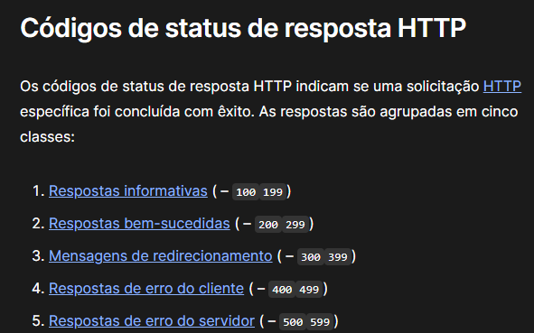

# Anotações da aula.

## Request body e response body

**Request body** é o que se é enviado para o servidor

**Response body** é o que o servidor retorna. 

## Informações sensíveis

Informações sensíveis devem ser passadas pelo método **POST** através do **body**

