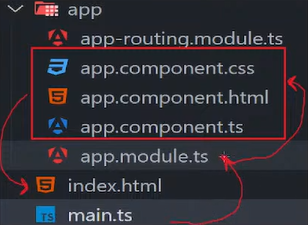

# Criando primeiro projeto com Angular

## Configurações iniciais

### Instalação normal [Global]
    - npm install -g @angular/cli
    - [-g = global]
    - Set-ExecutionPolicy Unrestricted []

### Máquinas do IF (Instituto federal)

### Criação da aplicação com Angular
    ng new primeiro-programa-angular --no-standalone

### Executar aplicação
    Entrar na pasta de aplicação do Angular.
    ng serve --open

### Single page application
    - Um elemento da página é alterado de forma unica, sem mexer no estado dos outros.
    - A página é apenas uma, sem ter links para um monte de outras páginas. 
    - Torna a navegação mais flexível e leve.

## O que são componentes e Angular?
No Angular, um componente é uma unidade autônoma e reutilizável de uma aplicação que encapsula o HTML, o CSS e a lógica relacionada. Cada componente representa uma parte específica da interface do usuário e interage com outros componentes para construir a aplicação como um todo.

Referência:  https://www.dio.me/articles/vantagens-de-utilizar-componentes-com-angular

# 
    Um componente em Angular sempre terá 3 arquivos
    Sendo: html, css, ts
    Isso pode variar, mas em geral são esses 3;

### Ordem de funcionamento.

     main.ts >> app.module.ts >> componentes >> index.html;
    
### Como criar um componente
    ng generate component nome-componente
    ng generate component components/views/home
    [Cria compoenente home dentro do app/components]

### Comandos usados em aula
    ng generate component components/views/home
    ng generate component components/shared/navbar
    ng g c components/views/login

    